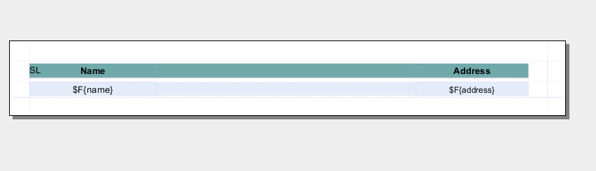
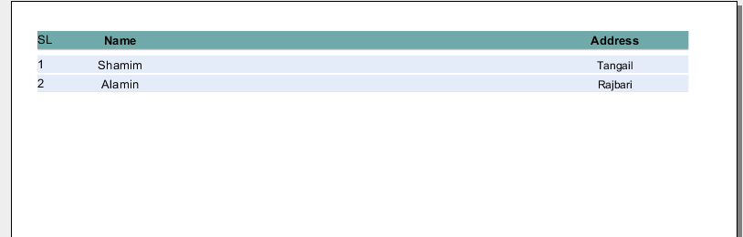
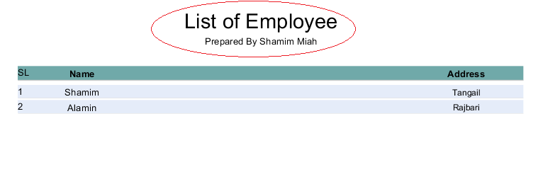

### JasperReports ###
The JasperReports Library is the world's most popular open source reporting engine. It is entirely written in Java and it is able to use data coming from any kind of data source and produce pixel-perfect documents that can be viewed, printed or exported in a variety of document formats including HTML, PDF, Excel, OpenOffice and Word.

### How to start ###
1. create java maven project <br/>
mvn archetype:generate -DgroupId=com.javaaround.TestApp -DartifactId=TestApp -DarchetypeArtifactId=maven-archetype-quickstart -DinteractiveMode=false
2. Add dependency at pom.xml
```xml
 <dependency>
      <groupId>net.sf.jasperreports</groupId>
      <artifactId>jasperreports</artifactId>
      <version>6.3.0</version>
    </dependency>
```
add `exec-maven-plugin` for execute app when maven package
```xml
<plugin>
          <groupId>org.codehaus.mojo</groupId>
          <artifactId>exec-maven-plugin</artifactId>
          <version>1.4.0</version>
          <executions>
            <execution>
              <id>my-execution</id>
              <phase>package</phase>
              <goals>
                <goal>java</goal>
              </goals>
            </execution>
          </executions>
          <configuration>
            <mainClass>com.javaaround.TestApp.App</mainClass>
            <!--<classpathScope>main</classpathScope> defualt-->
             <arguments>  
               <argument>arg0</argument>  
               <argument>arg1</argument>  
             </arguments>  
          </configuration>
        </plugin>
```
3.create report template file(template.jrxml)
```xml
<?xml version = "1.0" encoding = "UTF-8"?>
<!DOCTYPE jasperReport PUBLIC "//JasperReports//DTD Report Design//EN"
   "http://jasperreports.sourceforge.net/dtds/jasperreport.dtd">

<jasperReport xmlns = "http://jasperreports.sourceforge.net/jasperreports"
   xmlns:xsi = "http://www.w3.org/2001/XMLSchema-instance"
   xsi:schemaLocation = "http://jasperreports.sourceforge.net/jasperreports
   http://jasperreports.sourceforge.net/xsd/jasperreport.xsd"
   name = "template" language = "java" pageWidth = "595"
   pageHeight = "842" columnWidth = "555" leftMargin = "20" rightMargin = "20"
   topMargin = "20" bottomMargin = "20">
   
   <!-- a section of element content that is marked for the parser to 
   <br>interpret as only character data, not markup. -->
   <field name = "country" class = "java.lang.String">
      <fieldDescription><![CDATA[address]]></fieldDescription>
   </field>
   
   <field name = "name" class = "java.lang.String">
      <fieldDescription><![CDATA[name]]></fieldDescription>
   </field>	
   <columnHeader>
      <band height = "23">
         <staticText>
            <reportElement mode = "Opaque" x = "0" y = "3" 
               width = "535" height = "15" backcolor = "#70A9A9" />
            <box>
               <bottomPen lineWidth = "1.0" lineColor = "#CCCCCC" />
            </box>
            <textElement />
            <text><![CDATA[SL]]> </text>
         </staticText>
         
         <staticText>
            <reportElement x = "414" y = "3" width = "121" height = "15" />
            <textElement textAlignment = "Center" verticalAlignment = "Middle">
               <font isBold = "true" />
            </textElement>
            <text><![CDATA[Country]]></text>
         </staticText>
         
         <staticText>
            <reportElement x = "0" y = "3" width = "136" height = "15" />
            <textElement textAlignment = "Center" verticalAlignment = "Middle">
               <font isBold = "true" />
            </textElement>
            <text><![CDATA[Name]]></text>
         </staticText>
      </band>
   </columnHeader>
   
   <detail>
      <band height = "16">
         <staticText>
            <reportElement mode = "Opaque" x = "0" y = "0" 
               width = "535" height = "14" backcolor = "#E5ECF9" />
            <box>
               <bottomPen lineWidth = "0.25" lineColor = "#CCCCCC" />
            </box>
            <textElement />
            <text><![CDATA[]]> </text>
         </staticText>
         
         <textField>
            <reportElement x = "414" y = "0" width = "121" height = "15" />
            <textElement textAlignment = "Center" verticalAlignment = "Middle">
               <font size = "9" />
            </textElement>
            <textFieldExpression class = "java.lang.String">
               <![CDATA[$F{address}]]>
            </textFieldExpression>
         </textField>
         
         <textField>
            <reportElement x = "0" y = "0" width = "136" height = "15" />
            <textElement textAlignment = "Center" verticalAlignment = "Middle" />
            <textFieldExpression class = "java.lang.String">
               <![CDATA[$F{name}]]>
            </textFieldExpression>
         </textField>
      </band>
   </detail>
</jasperReport>
```  
4.create App.java
```java
package com.javaaround.TestApp;

import net.sf.jasperreports.engine.JRException;
import net.sf.jasperreports.engine.JasperPrint;
import net.sf.jasperreports.view.JasperDesignViewer;

public class App {
	public static void main(String[] args) throws JRException {
		
		 String sourceFileName = "F:/newsoft/workspace/TestApp/src/main/java/com/"+
		 "javaaround/TestApp/template.jrxml";       
		 JasperDesignViewer jasperDesignViewer =
		 new JasperDesignViewer(sourceFileName, true); // true means it not xml file 
		 jasperDesignViewer.setVisible(true); 
		
		
	}

}

``` 
5.Run app by following command
`mvn clean package` 


### Report Main Section ###
```xml
<title></title> <!-- only once at the beginning of the report-->

<pageheader></pageheader> <!-- each page in the generated document-->

<columnheader></columnheader> <!-- define column -->

<groupheader></groupheader> 

<detail></detail> <!-- each line of data supplied by the report's data source -->

<groupfooter></groupfooter>

<columnfooter></columnfooter>

<pagefooter></pagefooter> <!-- the bottom of each page -->

<lastpagefooter></lastpagefooter>

<summary></summary> <!-- only once at the end of the report -->

<nodata></nodata> <!-- produce the report output if no source data-->

<background></background> <!-- creating page watermarks -->
```
### Report Element ###
1. `<field name>` : This element is used to map data from data sources or queries
2. `<fieldDescription>` : This element maps the field name with the appropriate element in the XML file
3. `<staticText>` : contains static text
4. `<textField>` : define text field data
5. `<textFieldExpression>` : define variable expression
6. `$F{country}` : variable expression that map `<field name>`
7. `<band>` : Bands contain the data, which is displayed in the report.

### Report With static Data ###
update App.java
```java
package com.javaaround.TestApp;

import java.io.File;
import java.net.URISyntaxException;
import java.net.URL;
import java.util.ArrayList;
import java.util.HashMap;
import java.util.Map;

import com.javaaround.TestApp.model.Employee;

import net.sf.jasperreports.engine.JRException;
import net.sf.jasperreports.engine.JasperCompileManager;
import net.sf.jasperreports.engine.JasperFillManager;
import net.sf.jasperreports.engine.JasperPrint;
import net.sf.jasperreports.engine.JasperReport;
import net.sf.jasperreports.engine.data.JRBeanCollectionDataSource;
import net.sf.jasperreports.view.JasperDesignViewer;
import net.sf.jasperreports.view.JasperViewer;

public class App {
	public static void main(String[] args) throws JRException {

		JasperPrint jasperPrint = null;

		String sourceFileName = "F:/newsoft/workspace/TestApp/src/main/java/com/javaaround/TestApp/template.jrxml";
		/*JasperDesignViewer jasperDesignViewer = new JasperDesignViewer(sourceFileName, true); // true
		jasperDesignViewer.setVisible(true);*/
		
		//compile report first
		JasperReport jasperReport = JasperCompileManager.compileReport(sourceFileName);
		
		//data
		ArrayList<Employee> employeeList = new ArrayList<Employee>();
		employeeList.add(new Employee("Shamim", "Tangail"));
		employeeList.add(new Employee("Alamin", "Rajbari"));
		JRBeanCollectionDataSource beanColDataSource = new JRBeanCollectionDataSource(employeeList);

		Map parameters = new HashMap();
		try {
			//fill data
			jasperPrint = JasperFillManager.fillReport(jasperReport, parameters, beanColDataSource);
			JasperViewer.viewReport(jasperPrint, false);
		} catch (Exception e) {

		}
		
	}

}

```

update template.jrxml for auto serial number
```xml
	<!-- create variable for auto serial number -->
	<variable name = "countNumber" class = "java.lang.Integer" calculation = "Count">
      <variableExpression>
         <![CDATA[Boolean.TRUE]]>
      </variableExpression>
   </variable>
   <!-- display variable -->
   <textField>
	    <reportElement mode = "Opaque" x = "0" y = "0" 
	       width = "535" height = "14" backcolor = "#E5ECF9" />
	    
	    <box>
	       <bottomPen lineWidth = "0.25" lineColor = "#CCCCCC" />
	    </box>
	    
	    <textElement />
	    <textFieldExpression class = "java.lang.String">
	       <![CDATA[$V{countNumber}]]>
	    </textFieldExpression>
 	</textField>
```

Run app again by following command
`mvn clean package` 



### Exporting Reports(pdf,xls) ###
update App.java
```java
package com.javaaround.TestApp;

import java.io.File;
import java.util.ArrayList;
import java.util.HashMap;
import java.util.Map;

import com.javaaround.TestApp.model.Employee;

import net.sf.jasperreports.engine.JRException;
import net.sf.jasperreports.engine.JasperCompileManager;
import net.sf.jasperreports.engine.JasperExportManager;
import net.sf.jasperreports.engine.JasperFillManager;
import net.sf.jasperreports.engine.JasperPrint;
import net.sf.jasperreports.engine.JasperReport;
import net.sf.jasperreports.engine.data.JRBeanCollectionDataSource;
import net.sf.jasperreports.engine.export.ooxml.JRXlsxExporter;
import net.sf.jasperreports.export.SimpleExporterInput;
import net.sf.jasperreports.export.SimpleOutputStreamExporterOutput;
import net.sf.jasperreports.export.SimpleXlsxReportConfiguration;

public class App {
	public static void main(String[] args) throws JRException {

		JasperPrint jasperPrint = null;

		String sourceFileName = "F:/newsoft/workspace/TestApp/src/main/java/com/"+
		"javaaround/TestApp/template.jrxml";
		/*JasperDesignViewer jasperDesignViewer = new JasperDesignViewer(sourceFileName, true); // true
		jasperDesignViewer.setVisible(true);*/
		
		//compile report first
		JasperReport jasperReport = JasperCompileManager.compileReport(sourceFileName);
		
		//data
		ArrayList<Employee> employeeList = new ArrayList<Employee>();
		employeeList.add(new Employee("Shamim", "Tangail"));
		employeeList.add(new Employee("Alamin", "Rajbari"));
		JRBeanCollectionDataSource beanColDataSource = new JRBeanCollectionDataSource(employeeList);

		Map parameters = new HashMap();
		try {
			//fill data
			jasperPrint = JasperFillManager.fillReport(jasperReport, parameters, beanColDataSource);
			//JasperViewer.viewReport(jasperPrint, false);
			if (jasperPrint != null) {
	            //export pdf
	            JasperExportManager.exportReportToPdfFile(jasperPrint,
	               "F://sample_report.pdf");

	            //export html
	            JasperExportManager.exportReportToHtmlFile(jasperPrint,
	               "F://sample_report.html");

	            //export excel
	            JRXlsxExporter exporter = new JRXlsxExporter();
	            exporter.setExporterInput(new SimpleExporterInput(jasperPrint));
	            File outputFile = new File("F://sample_report.xlsx");
	            exporter.setExporterOutput(new SimpleOutputStreamExporterOutput(outputFile));
	            SimpleXlsxReportConfiguration configuration = new SimpleXlsxReportConfiguration(); 
	            configuration.setDetectCellType(true);//Set configuration as you like it!!
	            configuration.setCollapseRowSpan(false);
	            
	            exporter.setConfiguration(configuration);
	            
	            //export report
	            exporter.exportReport();

	         }
		} catch (Exception e) {

		}
		
	}

}

```

### Parameter pass to template ###
add param at App.java
```java
Map parameters = new HashMap();
// Passing ReportTitle and Author as parameters
parameters.put("ReportTitle", "List of Employee");
parameters.put("Author", "Prepared By Shamim Miah");
```

update template.jrxml
```xml
<parameter name = "ReportTitle" class = "java.lang.String"/>
<parameter name = "Author" class = "java.lang.String"/>
<title>
      <band height = "70">
         
         <line>
            <reportElement x = "0" y = "0" width = "515" height = "1"/>
         </line>
         
         <textField isBlankWhenNull = "true" bookmarkLevel = "1">
            <reportElement x = "0" y = "10" width = "515" height = "30"/>
           
            <textElement textAlignment = "Center">
               <font size = "22"/>
            </textElement>
            
            <textFieldExpression class = "java.lang.String">
               <![CDATA[$P{ReportTitle}]]>
            </textFieldExpression>
				
            <anchorNameExpression>
               <![CDATA["Title"]]>
            </anchorNameExpression>
         </textField>
         
         <textField isBlankWhenNull = "true">
            <reportElement  x = "0" y = "40" width = "515" height = "20"/>
            
            <textElement textAlignment = "Center">
               <font size = "10"/>
            </textElement>
            
            <textFieldExpression class = "java.lang.String">
               <![CDATA[$P{Author}]]>
            </textFieldExpression>
         </textField>
      
      </band>
   </title>
```

Run app again by following command
`mvn clean package` 



### Data from database ###
update App.java
```java
Class.forName("com.mysql.jdbc.Driver");
Connection connection = DriverManager.getConnection("jdbc:mysql://localhost:3306/test","root","");
//fill data
//jasperPrint = JasperFillManager.fillReport(jasperReport, parameters, beanColDataSource);
jasperPrint = JasperFillManager.fillReport(jasperReport, parameters, connection);
```

update template.jrxml
```xml
<queryString language="SQL">
		<![CDATA[SELECT name,address FROM employee2;]]>
</queryString>
```

### Expression Revised ###
| description        | format           | usage   |
| -----------------  |:---------------: | ------: |
| Field Reference    |$F{and}           | $F{Name}|
| Variable Reference |$V{and}           | $V{Name}|
| Parameter Reference|$P{and}           | $P{Name}|
| Resource Message   |$R{key}           | $R{report.title}|
| ifelse   |<![CDATA[$F{country}.isEmpty() ? "NO COUNTRY" : $F{country}]]>|

